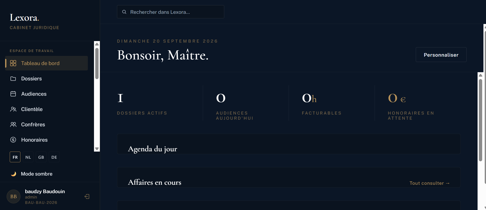
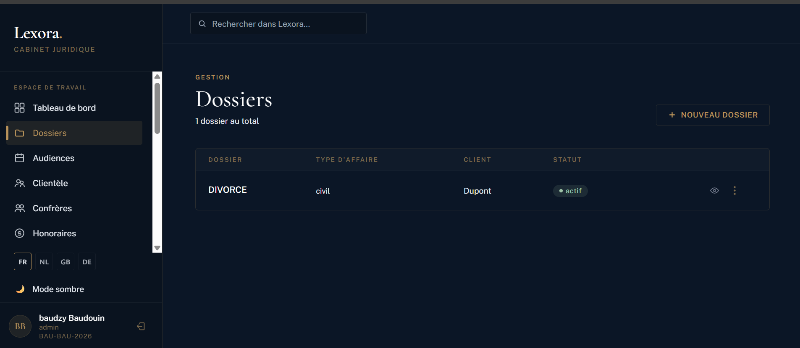
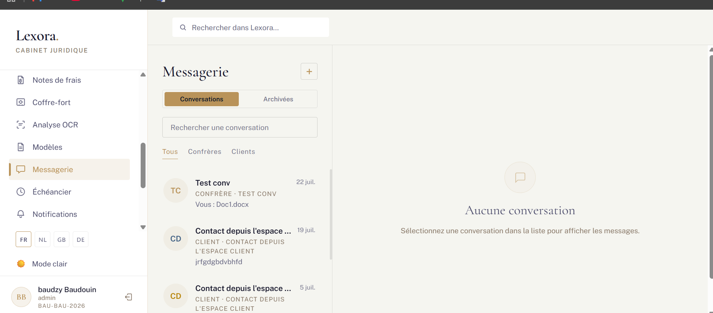

# Lexora — Plateforme de gestion pour cabinets d'avocats

> Application web full-stack qui centralise la gestion d'un cabinet d'avocats : clients, dossiers, audiences, comptabilité, communication interne et rédaction de documents.

**Projet personnel** développé par [Baudouin Ngondjeup Kepseu](https://www.linkedin.com/in/baudouin-ngondjeup) · Bruxelles, Belgique

> ℹ️ **Dépôt vitrine.** Le code source de Lexora est privé pour des raisons de confidentialité et de valorisation commerciale. Ce dépôt présente le projet, son architecture et ses fonctionnalités. **Accès au code sur demande** pour un entretien ou une évaluation technique : baudzyly@gmail.com

---

## Le problème

Les petits et moyens cabinets d'avocats jonglent entre un agenda, un tableur de facturation, une boîte mail et des dossiers papier. Les solutions du marché (Kleos, Clio) sont complètes mais coûteuses et lourdes à déployer. Lexora vise le même périmètre fonctionnel avec une prise en main immédiate et un déploiement léger.

## Aperçu

<!-- Remplace ces lignes par tes vraies captures : place les images dans un dossier /screenshots du dépôt -->
| Tableau de bord | Gestion des dossiers |
|---|---|
|  |  |

| Messagerie interne | Comptabilité |
|---|---|
|  |  |

---

## Fonctionnalités

### Cœur métier
- **Clients et dossiers** — fiches complètes, historique, documents liés, détection de conflits d'intérêts
- **Audiences et échéances** — distinction entre tâches internes et échéances légales, rappels automatiques
- **Timer universel** — chronométrage des prestations depuis n'importe quel écran, pour une facturation à l'heure exacte
- **Comptabilité** — notes de provision, facturation conforme aux usages belges, suivi des paiements
- **Multi-bureaux** — gestion de plusieurs implantations, des confrères et des congés

### Communication
- **Messagerie interne** de type WhatsApp : accusés de lecture, réactions, réponses, envoi de fichiers, épinglage, archivage, transfert et recherche
- **Modèles de documents** et génération de courriers
- **Signatures électroniques**

### Intelligence artificielle
- **RAG sur les dossiers** — interrogation en langage naturel du contenu des dossiers du cabinet
- **Rédaction assistée** de courriers à partir du contexte du dossier
- **OCR** (Tesseract) pour rendre les documents scannés exploitables

### Sécurité et conformité
- **Authentification 2FA** (TOTP) et matricule unique par utilisateur
- **Permissions granulaires** par rôle et par module
- **Vault protégé par code PIN** pour les données sensibles
- **Journal d'audit** complet des actions utilisateurs
- **Codes de récupération d'urgence** et politique de mots de passe stricte

### Confort d'usage
- Interface en **4 langues** (i18next)
- **Mode clair / sombre**
- **Recherche globale** transversale
- **Tableau de bord statistique** (Recharts)
- **Exports Excel et PDF**
- **Paiements en ligne** : Mollie, Stripe, PayPal

---

## Stack technique

**Back-end**
- Python · Flask · SQLAlchemy
- Authentification JWT, TOTP (2FA)
- PostgreSQL en production, SQLite en développement

**Front-end**
- React · TypeScript · Vite
- Recharts (visualisation), i18next (internationalisation)

**Intégrations**
- Mollie, Stripe, PayPal (paiements)
- Google Gemini (IA générative et RAG)
- Tesseract (OCR)

---

## Architecture

```
┌─────────────────────┐        ┌──────────────────────┐
│   Front-end React   │  REST  │   API Flask          │
│   TypeScript, Vite  │ ◄────► │   JWT · permissions  │
└─────────────────────┘        └──────────┬───────────┘
                                          │ SQLAlchemy
                                          ▼
                               ┌──────────────────────┐
                               │   PostgreSQL         │
                               └──────────────────────┘
                                          ▲
                        ┌─────────────────┴──────────────────┐
                        │  Services : OCR · IA (RAG) ·        │
                        │  Paiements · Exports · E-mails      │
                        └─────────────────────────────────────┘
```

L'API est organisée par modules métier (dossiers, comptabilité, messagerie, administration), chacun avec ses modèles, ses routes et ses règles de permission. Toute action sensible passe par le journal d'audit.

---

## Ce que ce projet m'a appris

- **Concevoir à partir du métier** : analyse comparative des solutions existantes (Kleos, Clio) pour identifier les fonctions réellement utilisées au quotidien par un cabinet, avant d'écrire la première ligne de code.
- **Construire une sécurité sérieuse** : 2FA, permissions granulaires, journal d'audit et vault ne s'ajoutent pas à la fin — ils structurent le modèle de données dès le départ.
- **Livrer une application complète**, du schéma de base de données au déploiement, en passant par l'internationalisation, les exports et les intégrations de paiement.
- **Intégrer l'IA utilement** : le RAG sur les dossiers ne sert que s'il respecte les permissions de l'utilisateur qui pose la question.

---

## Statut

Projet en développement actif. Un avocat a manifesté un intérêt commercial pour la solution ; un devis de licence et de déploiement en production a été établi.

---

## Contact

**Baudouin Ngondjeup Kepseu** — Développeur full-stack junior
📧 baudzyly@gmail.com · 💼 [LinkedIn](https://www.linkedin.com/in/baudouin-ngondjeup) · 💻 [GitHub](https://github.com/baudouin123)

Étudiant en dernière année d'informatique de gestion (EAFC-ISFCE Uccle), diplôme prévu en octobre 2027. À la recherche d'un premier poste de développeur ou d'analyste-développeur à Bruxelles.
